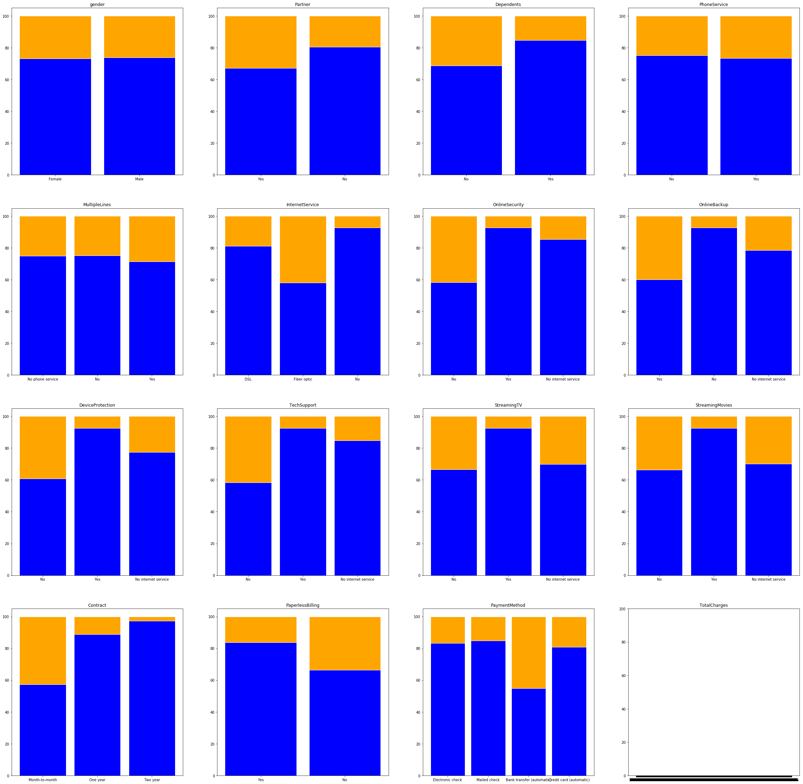
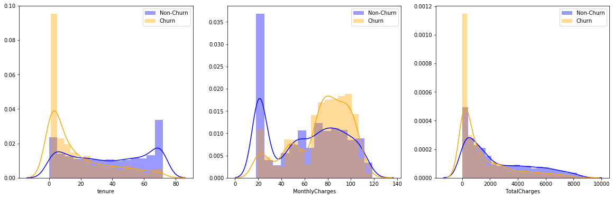
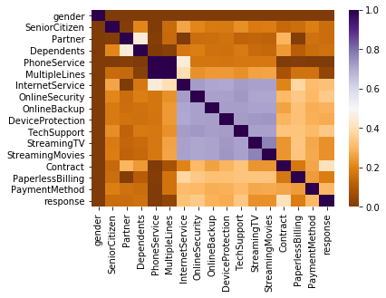
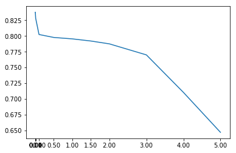
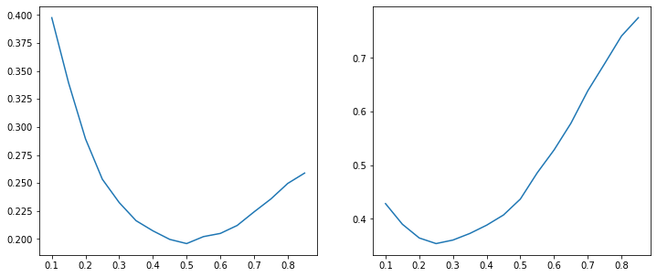

<font size="8">Customer churn prediction model - Telecom</font>

<font size="4">by: Utkarsh Singh</font>

# Import libraries


```python
import pandas as pd, numpy as np, scipy as sp, sklearn , matplotlib.pyplot as plt, seaborn as sb,plotly as ply, statsmodels, warnings
```


```python
import os
os.chdir("C:\\Users\\Hi\\Documents\\UC BANA Master\\Data science - Python\\telco-customer-churn - Kaggle")
```

# Define functions


```python
# Obtain frequency for all categorical variables

def categorical_var_freq(df):
    x=0
    while x < len(list(df.select_dtypes(include = "object").columns)):
        varname = list(df.select_dtypes(include = "object").columns)[x]
        print(varname,"\n")
        print(pd.DataFrame(df[varname].value_counts()),"\n")
        x=x+1

        
# Cramer's V statistic for measuring association between categorical predictors

import scipy.stats as ss

def cramers_v(X,Y):
    confusion_matrix = pd.crosstab(X,Y).values
    chi2 = ss.chi2_contingency(confusion_matrix)[0]
    n = confusion_matrix.sum()
    phi2 = chi2/n
    r,k = confusion_matrix.shape
    phi2corr = max(0, phi2-((k-1)*(r-1))/(n-1))
    rcorr = r-((r-1)**2)/(n-1)
    kcorr = k-((k-1)**2)/(n-1)
    return np.sqrt(phi2corr/min((kcorr-1),(rcorr-1)))

# Symmetric misclassification using p threshold

def symm_misclassif(y_true,y_pred): 
    FP = np.sum((y_pred.reshape((y_true.shape[0],1))>p) & (y_true==0)) 
    FN = np.sum((y_pred.reshape((y_true.shape[0],1))<=p) & (y_true==1)) 
    misclassification = FP+FN 
    misclassification_rate = misclassification/y_true.shape[0] 
    return misclassification_rate

# Asymmetric misclassification using p threshold and 1:3 class weights for 0:1

def asymm_misclassif(y_true,y_pred): 
    FP = (y_pred.reshape((y_true.shape[0],1))>p) & (y_true==0)
    FN = (y_pred.reshape((y_true.shape[0],1))<=p) & (y_true==1)
    misclassification_rate = np.mean(FP+np.multiply(FN,3))
    return misclassification_rate
```

# Read raw data


```python
churndata = pd.read_csv("WA_Fn-UseC_-Telco-Customer-Churn.csv")
```


```python
churndata.shape
```


    (7043, 21)


```python
display(churndata.iloc[1:10,:])
```


<div>
<style scoped>
    .dataframe tbody tr th:only-of-type {
        vertical-align: middle;
    }

    .dataframe tbody tr th {
        vertical-align: top;
    }

    .dataframe thead th {
        text-align: right;
    }
</style>
<table border="1" class="dataframe">
  <thead>
    <tr style="text-align: right;">
      <th></th>
      <th>customerID</th>
      <th>gender</th>
      <th>SeniorCitizen</th>
      <th>Partner</th>
      <th>Dependents</th>
      <th>tenure</th>
      <th>PhoneService</th>
      <th>MultipleLines</th>
      <th>InternetService</th>
      <th>OnlineSecurity</th>
      <th>...</th>
      <th>DeviceProtection</th>
      <th>TechSupport</th>
      <th>StreamingTV</th>
      <th>StreamingMovies</th>
      <th>Contract</th>
      <th>PaperlessBilling</th>
      <th>PaymentMethod</th>
      <th>MonthlyCharges</th>
      <th>TotalCharges</th>
      <th>response</th>
    </tr>
  </thead>
  <tbody>
    <tr>
      <th>1</th>
      <td>5575-GNVDE</td>
      <td>Male</td>
      <td>0</td>
      <td>No</td>
      <td>No</td>
      <td>34</td>
      <td>Yes</td>
      <td>No</td>
      <td>DSL</td>
      <td>Yes</td>
      <td>...</td>
      <td>Yes</td>
      <td>No</td>
      <td>No</td>
      <td>No</td>
      <td>One year</td>
      <td>No</td>
      <td>Mailed check</td>
      <td>56.95</td>
      <td>1889.5</td>
      <td>0</td>
    </tr>
    <tr>
      <th>2</th>
      <td>3668-QPYBK</td>
      <td>Male</td>
      <td>0</td>
      <td>No</td>
      <td>No</td>
      <td>2</td>
      <td>Yes</td>
      <td>No</td>
      <td>DSL</td>
      <td>Yes</td>
      <td>...</td>
      <td>No</td>
      <td>No</td>
      <td>No</td>
      <td>No</td>
      <td>Month-to-month</td>
      <td>Yes</td>
      <td>Mailed check</td>
      <td>53.85</td>
      <td>108.15</td>
      <td>1</td>
    </tr>
    <tr>
      <th>3</th>
      <td>7795-CFOCW</td>
      <td>Male</td>
      <td>0</td>
      <td>No</td>
      <td>No</td>
      <td>45</td>
      <td>No</td>
      <td>No phone service</td>
      <td>DSL</td>
      <td>Yes</td>
      <td>...</td>
      <td>Yes</td>
      <td>Yes</td>
      <td>No</td>
      <td>No</td>
      <td>One year</td>
      <td>No</td>
      <td>Bank transfer (automatic)</td>
      <td>42.30</td>
      <td>1840.75</td>
      <td>0</td>
    </tr>
    <tr>
      <th>4</th>
      <td>9237-HQITU</td>
      <td>Female</td>
      <td>0</td>
      <td>No</td>
      <td>No</td>
      <td>2</td>
      <td>Yes</td>
      <td>No</td>
      <td>Fiber optic</td>
      <td>No</td>
      <td>...</td>
      <td>No</td>
      <td>No</td>
      <td>No</td>
      <td>No</td>
      <td>Month-to-month</td>
      <td>Yes</td>
      <td>Electronic check</td>
      <td>70.70</td>
      <td>151.65</td>
      <td>1</td>
    </tr>
    <tr>
      <th>5</th>
      <td>9305-CDSKC</td>
      <td>Female</td>
      <td>0</td>
      <td>No</td>
      <td>No</td>
      <td>8</td>
      <td>Yes</td>
      <td>Yes</td>
      <td>Fiber optic</td>
      <td>No</td>
      <td>...</td>
      <td>Yes</td>
      <td>No</td>
      <td>Yes</td>
      <td>Yes</td>
      <td>Month-to-month</td>
      <td>Yes</td>
      <td>Electronic check</td>
      <td>99.65</td>
      <td>820.5</td>
      <td>1</td>
    </tr>
    <tr>
      <th>6</th>
      <td>1452-KIOVK</td>
      <td>Male</td>
      <td>0</td>
      <td>No</td>
      <td>Yes</td>
      <td>22</td>
      <td>Yes</td>
      <td>Yes</td>
      <td>Fiber optic</td>
      <td>No</td>
      <td>...</td>
      <td>No</td>
      <td>No</td>
      <td>Yes</td>
      <td>No</td>
      <td>Month-to-month</td>
      <td>Yes</td>
      <td>Credit card (automatic)</td>
      <td>89.10</td>
      <td>1949.4</td>
      <td>0</td>
    </tr>
    <tr>
      <th>7</th>
      <td>6713-OKOMC</td>
      <td>Female</td>
      <td>0</td>
      <td>No</td>
      <td>No</td>
      <td>10</td>
      <td>No</td>
      <td>No phone service</td>
      <td>DSL</td>
      <td>Yes</td>
      <td>...</td>
      <td>No</td>
      <td>No</td>
      <td>No</td>
      <td>No</td>
      <td>Month-to-month</td>
      <td>No</td>
      <td>Mailed check</td>
      <td>29.75</td>
      <td>301.9</td>
      <td>0</td>
    </tr>
    <tr>
      <th>8</th>
      <td>7892-POOKP</td>
      <td>Female</td>
      <td>0</td>
      <td>Yes</td>
      <td>No</td>
      <td>28</td>
      <td>Yes</td>
      <td>Yes</td>
      <td>Fiber optic</td>
      <td>No</td>
      <td>...</td>
      <td>Yes</td>
      <td>Yes</td>
      <td>Yes</td>
      <td>Yes</td>
      <td>Month-to-month</td>
      <td>Yes</td>
      <td>Electronic check</td>
      <td>104.80</td>
      <td>3046.05</td>
      <td>1</td>
    </tr>
    <tr>
      <th>9</th>
      <td>6388-TABGU</td>
      <td>Male</td>
      <td>0</td>
      <td>No</td>
      <td>Yes</td>
      <td>62</td>
      <td>Yes</td>
      <td>No</td>
      <td>DSL</td>
      <td>Yes</td>
      <td>...</td>
      <td>No</td>
      <td>No</td>
      <td>No</td>
      <td>No</td>
      <td>One year</td>
      <td>No</td>
      <td>Bank transfer (automatic)</td>
      <td>56.15</td>
      <td>3487.95</td>
      <td>0</td>
    </tr>
  </tbody>
</table>
<p>9 rows × 21 columns</p>
</div>


# Data quality


```python
# Columns

churndata.dtypes
```


    customerID           object
    gender               object
    SeniorCitizen         int64
    Partner              object
    Dependents           object
    tenure                int64
    PhoneService         object
    MultipleLines        object
    InternetService      object
    OnlineSecurity       object
    OnlineBackup         object
    DeviceProtection     object
    TechSupport          object
    StreamingTV          object
    StreamingMovies      object
    Contract             object
    PaperlessBilling     object
    PaymentMethod        object
    MonthlyCharges      float64
    TotalCharges         object
    Churn                object
    dtype: object


```python
# Convert datatype of TotalCharges column
churndata['TotalCharges'].replace(" ",np.nan,inplace=True)
churndata['TotalCharges'] = churndata['TotalCharges'].astype("float")
```


```python
# Primary key uniqueness

print(churndata['customerID'].nunique())
print(churndata.shape)
```

    7043
    (7043, 21)
    


```python

churndata.isna().sum()

# test = churndata.dropna(axis=0)
# test.to_csv("TelcoChurnClean.csv")
```


    customerID           0
    gender               0
    SeniorCitizen        0
    Partner              0
    Dependents           0
    tenure               0
    PhoneService         0
    MultipleLines        0
    InternetService      0
    OnlineSecurity       0
    OnlineBackup         0
    DeviceProtection     0
    TechSupport          0
    StreamingTV          0
    StreamingMovies      0
    Contract             0
    PaperlessBilling     0
    PaymentMethod        0
    MonthlyCharges       0
    TotalCharges        11
    Churn                0
    dtype: int64


**11** missing values found in the column TotalCharges.

# Data Exploration

## Convert response variable into integer 0/1


```python
churndata['response'] = churndata['Churn'].apply(lambda x: 1 if x == 'Yes' else 0)
churndata.drop(['Churn'],axis=1,inplace=True)
display(churndata)
```


<div>
<style scoped>
    .dataframe tbody tr th:only-of-type {
        vertical-align: middle;
    }

    .dataframe tbody tr th {
        vertical-align: top;
    }

    .dataframe thead th {
        text-align: right;
    }
</style>
<table border="1" class="dataframe">
  <thead>
    <tr style="text-align: right;">
      <th></th>
      <th>customerID</th>
      <th>gender</th>
      <th>SeniorCitizen</th>
      <th>Partner</th>
      <th>Dependents</th>
      <th>tenure</th>
      <th>PhoneService</th>
      <th>MultipleLines</th>
      <th>InternetService</th>
      <th>OnlineSecurity</th>
      <th>...</th>
      <th>DeviceProtection</th>
      <th>TechSupport</th>
      <th>StreamingTV</th>
      <th>StreamingMovies</th>
      <th>Contract</th>
      <th>PaperlessBilling</th>
      <th>PaymentMethod</th>
      <th>MonthlyCharges</th>
      <th>TotalCharges</th>
      <th>response</th>
    </tr>
  </thead>
  <tbody>
    <tr>
      <th>0</th>
      <td>7590-VHVEG</td>
      <td>Female</td>
      <td>0</td>
      <td>Yes</td>
      <td>No</td>
      <td>1</td>
      <td>No</td>
      <td>No phone service</td>
      <td>DSL</td>
      <td>No</td>
      <td>...</td>
      <td>No</td>
      <td>No</td>
      <td>No</td>
      <td>No</td>
      <td>Month-to-month</td>
      <td>Yes</td>
      <td>Electronic check</td>
      <td>29.85</td>
      <td>29.85</td>
      <td>0</td>
    </tr>
    <tr>
      <th>1</th>
      <td>5575-GNVDE</td>
      <td>Male</td>
      <td>0</td>
      <td>No</td>
      <td>No</td>
      <td>34</td>
      <td>Yes</td>
      <td>No</td>
      <td>DSL</td>
      <td>Yes</td>
      <td>...</td>
      <td>Yes</td>
      <td>No</td>
      <td>No</td>
      <td>No</td>
      <td>One year</td>
      <td>No</td>
      <td>Mailed check</td>
      <td>56.95</td>
      <td>1889.50</td>
      <td>0</td>
    </tr>
    <tr>
      <th>2</th>
      <td>3668-QPYBK</td>
      <td>Male</td>
      <td>0</td>
      <td>No</td>
      <td>No</td>
      <td>2</td>
      <td>Yes</td>
      <td>No</td>
      <td>DSL</td>
      <td>Yes</td>
      <td>...</td>
      <td>No</td>
      <td>No</td>
      <td>No</td>
      <td>No</td>
      <td>Month-to-month</td>
      <td>Yes</td>
      <td>Mailed check</td>
      <td>53.85</td>
      <td>108.15</td>
      <td>1</td>
    </tr>
    <tr>
      <th>3</th>
      <td>7795-CFOCW</td>
      <td>Male</td>
      <td>0</td>
      <td>No</td>
      <td>No</td>
      <td>45</td>
      <td>No</td>
      <td>No phone service</td>
      <td>DSL</td>
      <td>Yes</td>
      <td>...</td>
      <td>Yes</td>
      <td>Yes</td>
      <td>No</td>
      <td>No</td>
      <td>One year</td>
      <td>No</td>
      <td>Bank transfer (automatic)</td>
      <td>42.30</td>
      <td>1840.75</td>
      <td>0</td>
    </tr>
    <tr>
      <th>4</th>
      <td>9237-HQITU</td>
      <td>Female</td>
      <td>0</td>
      <td>No</td>
      <td>No</td>
      <td>2</td>
      <td>Yes</td>
      <td>No</td>
      <td>Fiber optic</td>
      <td>No</td>
      <td>...</td>
      <td>No</td>
      <td>No</td>
      <td>No</td>
      <td>No</td>
      <td>Month-to-month</td>
      <td>Yes</td>
      <td>Electronic check</td>
      <td>70.70</td>
      <td>151.65</td>
      <td>1</td>
    </tr>
    <tr>
      <th>...</th>
      <td>...</td>
      <td>...</td>
      <td>...</td>
      <td>...</td>
      <td>...</td>
      <td>...</td>
      <td>...</td>
      <td>...</td>
      <td>...</td>
      <td>...</td>
      <td>...</td>
      <td>...</td>
      <td>...</td>
      <td>...</td>
      <td>...</td>
      <td>...</td>
      <td>...</td>
      <td>...</td>
      <td>...</td>
      <td>...</td>
      <td>...</td>
    </tr>
    <tr>
      <th>7038</th>
      <td>6840-RESVB</td>
      <td>Male</td>
      <td>0</td>
      <td>Yes</td>
      <td>Yes</td>
      <td>24</td>
      <td>Yes</td>
      <td>Yes</td>
      <td>DSL</td>
      <td>Yes</td>
      <td>...</td>
      <td>Yes</td>
      <td>Yes</td>
      <td>Yes</td>
      <td>Yes</td>
      <td>One year</td>
      <td>Yes</td>
      <td>Mailed check</td>
      <td>84.80</td>
      <td>1990.50</td>
      <td>0</td>
    </tr>
    <tr>
      <th>7039</th>
      <td>2234-XADUH</td>
      <td>Female</td>
      <td>0</td>
      <td>Yes</td>
      <td>Yes</td>
      <td>72</td>
      <td>Yes</td>
      <td>Yes</td>
      <td>Fiber optic</td>
      <td>No</td>
      <td>...</td>
      <td>Yes</td>
      <td>No</td>
      <td>Yes</td>
      <td>Yes</td>
      <td>One year</td>
      <td>Yes</td>
      <td>Credit card (automatic)</td>
      <td>103.20</td>
      <td>7362.90</td>
      <td>0</td>
    </tr>
    <tr>
      <th>7040</th>
      <td>4801-JZAZL</td>
      <td>Female</td>
      <td>0</td>
      <td>Yes</td>
      <td>Yes</td>
      <td>11</td>
      <td>No</td>
      <td>No phone service</td>
      <td>DSL</td>
      <td>Yes</td>
      <td>...</td>
      <td>No</td>
      <td>No</td>
      <td>No</td>
      <td>No</td>
      <td>Month-to-month</td>
      <td>Yes</td>
      <td>Electronic check</td>
      <td>29.60</td>
      <td>346.45</td>
      <td>0</td>
    </tr>
    <tr>
      <th>7041</th>
      <td>8361-LTMKD</td>
      <td>Male</td>
      <td>1</td>
      <td>Yes</td>
      <td>No</td>
      <td>4</td>
      <td>Yes</td>
      <td>Yes</td>
      <td>Fiber optic</td>
      <td>No</td>
      <td>...</td>
      <td>No</td>
      <td>No</td>
      <td>No</td>
      <td>No</td>
      <td>Month-to-month</td>
      <td>Yes</td>
      <td>Mailed check</td>
      <td>74.40</td>
      <td>306.60</td>
      <td>1</td>
    </tr>
    <tr>
      <th>7042</th>
      <td>3186-AJIEK</td>
      <td>Male</td>
      <td>0</td>
      <td>No</td>
      <td>No</td>
      <td>66</td>
      <td>Yes</td>
      <td>No</td>
      <td>Fiber optic</td>
      <td>Yes</td>
      <td>...</td>
      <td>Yes</td>
      <td>Yes</td>
      <td>Yes</td>
      <td>Yes</td>
      <td>Two year</td>
      <td>Yes</td>
      <td>Bank transfer (automatic)</td>
      <td>105.65</td>
      <td>6844.50</td>
      <td>0</td>
    </tr>
  </tbody>
</table>
<p>7043 rows × 21 columns</p>
</div>


## Stacked bar: All categorical variables vs response

Let us look at the distribution of the response variable across levels of each categorical variable


```python
df = churndata.copy()
target = 'response'
dataid = 'customerID'

categcolnames = list(df.select_dtypes(include = "object").columns)
categcolnames.remove('customerID')


fig, axes = plt.subplots(4, 4, figsize=(40,40))


for var,ax in zip(categcolnames,axes.flatten()):

    plotdf1 = df[[dataid,target,var]].groupby([var,target])[[dataid]].nunique().reset_index().pivot(index = var,columns = target,values =dataid).reset_index().replace(np.nan,0)
    totals = [i+j for i,j in zip(plotdf1[0], plotdf1[1])]
    nonevents = [i / j * 100 for i,j in zip(plotdf1[0], totals)]
    events = [i / j * 100 for i,j in zip(plotdf1[1], totals)]

    barWidth = 0.85
    names = df[var].unique()
    r = list(range(len(names)))
    # Create nonevents bar
    ax.bar(r, nonevents, color='blue', edgecolor='white', width=barWidth)
    # Create events Bars
    ax.bar(r, events, bottom=nonevents, color='orange', edgecolor='white', width=barWidth)
    # Custom x axis
#     ax.xticks(r, names, rotation=45)
    ax.set_title(var)
    ax.set_xticks(r)
    ax.set_xticklabels(names)

```





```python

```

## Histograms - Continuous variables vs response

Let us now check distribution of continuous variables for the churn and non-churn customers


```python
warnings.simplefilter('ignore')

df0 = churndata[churndata['response']==0]
df1 = churndata[churndata['response']==1]

numericcolnames = list(df.select_dtypes(exclude = "object").columns)

fig, axes = plt.subplots(1, 3, figsize=(20,6))

for var,axe in zip(numericcolnames,axes.flatten()):
    sb.distplot(df0[var],color="blue",label='Non-Churn',ax=axe);
    sb.distplot(df1[var],color="orange",label='Churn',ax=axe);
    axe.legend(loc='best');

```





<br>

There is a significant difference between the distributions of **Tenure** and **Monthly Charges** for Churned and Retained customers

## Class proportion


```python
print('proportion of churned customers is: ',np.around((churndata['response'].mean())*100,decimals=2),'%')
```

    proportion of churned customers is:  26.54 %
    

## Variable Summary


```python
churndata.drop(['customerID'],axis=1).describe(include="all")
```


<div>
<style scoped>
    .dataframe tbody tr th:only-of-type {
        vertical-align: middle;
    }

    .dataframe tbody tr th {
        vertical-align: top;
    }

    .dataframe thead th {
        text-align: right;
    }
</style>
<table border="1" class="dataframe">
  <thead>
    <tr style="text-align: right;">
      <th></th>
      <th>gender</th>
      <th>SeniorCitizen</th>
      <th>Partner</th>
      <th>Dependents</th>
      <th>tenure</th>
      <th>PhoneService</th>
      <th>MultipleLines</th>
      <th>InternetService</th>
      <th>OnlineSecurity</th>
      <th>OnlineBackup</th>
      <th>DeviceProtection</th>
      <th>TechSupport</th>
      <th>StreamingTV</th>
      <th>StreamingMovies</th>
      <th>Contract</th>
      <th>PaperlessBilling</th>
      <th>PaymentMethod</th>
      <th>MonthlyCharges</th>
      <th>TotalCharges</th>
      <th>response</th>
    </tr>
  </thead>
  <tbody>
    <tr>
      <th>count</th>
      <td>7043</td>
      <td>7043.000000</td>
      <td>7043</td>
      <td>7043</td>
      <td>7043.000000</td>
      <td>7043</td>
      <td>7043</td>
      <td>7043</td>
      <td>7043</td>
      <td>7043</td>
      <td>7043</td>
      <td>7043</td>
      <td>7043</td>
      <td>7043</td>
      <td>7043</td>
      <td>7043</td>
      <td>7043</td>
      <td>7043.000000</td>
      <td>7043</td>
      <td>7043.000000</td>
    </tr>
    <tr>
      <th>unique</th>
      <td>2</td>
      <td>NaN</td>
      <td>2</td>
      <td>2</td>
      <td>NaN</td>
      <td>2</td>
      <td>3</td>
      <td>3</td>
      <td>3</td>
      <td>3</td>
      <td>3</td>
      <td>3</td>
      <td>3</td>
      <td>3</td>
      <td>3</td>
      <td>2</td>
      <td>4</td>
      <td>NaN</td>
      <td>6531</td>
      <td>NaN</td>
    </tr>
    <tr>
      <th>top</th>
      <td>Male</td>
      <td>NaN</td>
      <td>No</td>
      <td>No</td>
      <td>NaN</td>
      <td>Yes</td>
      <td>No</td>
      <td>Fiber optic</td>
      <td>No</td>
      <td>No</td>
      <td>No</td>
      <td>No</td>
      <td>No</td>
      <td>No</td>
      <td>Month-to-month</td>
      <td>Yes</td>
      <td>Electronic check</td>
      <td>NaN</td>
      <td></td>
      <td>NaN</td>
    </tr>
    <tr>
      <th>freq</th>
      <td>3555</td>
      <td>NaN</td>
      <td>3641</td>
      <td>4933</td>
      <td>NaN</td>
      <td>6361</td>
      <td>3390</td>
      <td>3096</td>
      <td>3498</td>
      <td>3088</td>
      <td>3095</td>
      <td>3473</td>
      <td>2810</td>
      <td>2785</td>
      <td>3875</td>
      <td>4171</td>
      <td>2365</td>
      <td>NaN</td>
      <td>11</td>
      <td>NaN</td>
    </tr>
    <tr>
      <th>mean</th>
      <td>NaN</td>
      <td>0.162147</td>
      <td>NaN</td>
      <td>NaN</td>
      <td>32.371149</td>
      <td>NaN</td>
      <td>NaN</td>
      <td>NaN</td>
      <td>NaN</td>
      <td>NaN</td>
      <td>NaN</td>
      <td>NaN</td>
      <td>NaN</td>
      <td>NaN</td>
      <td>NaN</td>
      <td>NaN</td>
      <td>NaN</td>
      <td>64.761692</td>
      <td>NaN</td>
      <td>0.265370</td>
    </tr>
    <tr>
      <th>std</th>
      <td>NaN</td>
      <td>0.368612</td>
      <td>NaN</td>
      <td>NaN</td>
      <td>24.559481</td>
      <td>NaN</td>
      <td>NaN</td>
      <td>NaN</td>
      <td>NaN</td>
      <td>NaN</td>
      <td>NaN</td>
      <td>NaN</td>
      <td>NaN</td>
      <td>NaN</td>
      <td>NaN</td>
      <td>NaN</td>
      <td>NaN</td>
      <td>30.090047</td>
      <td>NaN</td>
      <td>0.441561</td>
    </tr>
    <tr>
      <th>min</th>
      <td>NaN</td>
      <td>0.000000</td>
      <td>NaN</td>
      <td>NaN</td>
      <td>0.000000</td>
      <td>NaN</td>
      <td>NaN</td>
      <td>NaN</td>
      <td>NaN</td>
      <td>NaN</td>
      <td>NaN</td>
      <td>NaN</td>
      <td>NaN</td>
      <td>NaN</td>
      <td>NaN</td>
      <td>NaN</td>
      <td>NaN</td>
      <td>18.250000</td>
      <td>NaN</td>
      <td>0.000000</td>
    </tr>
    <tr>
      <th>25%</th>
      <td>NaN</td>
      <td>0.000000</td>
      <td>NaN</td>
      <td>NaN</td>
      <td>9.000000</td>
      <td>NaN</td>
      <td>NaN</td>
      <td>NaN</td>
      <td>NaN</td>
      <td>NaN</td>
      <td>NaN</td>
      <td>NaN</td>
      <td>NaN</td>
      <td>NaN</td>
      <td>NaN</td>
      <td>NaN</td>
      <td>NaN</td>
      <td>35.500000</td>
      <td>NaN</td>
      <td>0.000000</td>
    </tr>
    <tr>
      <th>50%</th>
      <td>NaN</td>
      <td>0.000000</td>
      <td>NaN</td>
      <td>NaN</td>
      <td>29.000000</td>
      <td>NaN</td>
      <td>NaN</td>
      <td>NaN</td>
      <td>NaN</td>
      <td>NaN</td>
      <td>NaN</td>
      <td>NaN</td>
      <td>NaN</td>
      <td>NaN</td>
      <td>NaN</td>
      <td>NaN</td>
      <td>NaN</td>
      <td>70.350000</td>
      <td>NaN</td>
      <td>0.000000</td>
    </tr>
    <tr>
      <th>75%</th>
      <td>NaN</td>
      <td>0.000000</td>
      <td>NaN</td>
      <td>NaN</td>
      <td>55.000000</td>
      <td>NaN</td>
      <td>NaN</td>
      <td>NaN</td>
      <td>NaN</td>
      <td>NaN</td>
      <td>NaN</td>
      <td>NaN</td>
      <td>NaN</td>
      <td>NaN</td>
      <td>NaN</td>
      <td>NaN</td>
      <td>NaN</td>
      <td>89.850000</td>
      <td>NaN</td>
      <td>1.000000</td>
    </tr>
    <tr>
      <th>max</th>
      <td>NaN</td>
      <td>1.000000</td>
      <td>NaN</td>
      <td>NaN</td>
      <td>72.000000</td>
      <td>NaN</td>
      <td>NaN</td>
      <td>NaN</td>
      <td>NaN</td>
      <td>NaN</td>
      <td>NaN</td>
      <td>NaN</td>
      <td>NaN</td>
      <td>NaN</td>
      <td>NaN</td>
      <td>NaN</td>
      <td>NaN</td>
      <td>118.750000</td>
      <td>NaN</td>
      <td>1.000000</td>
    </tr>
  </tbody>
</table>
</div>


```python
categorical_var_freq(churndata.drop(['customerID'],axis=1))
```

    gender 
    
            gender
    Male      3555
    Female    3488 
    
    SeniorCitizen 
    
       SeniorCitizen
    0           5901
    1           1142 
    
    Partner 
    
         Partner
    No      3641
    Yes     3402 
    
    Dependents 
    
         Dependents
    No         4933
    Yes        2110 
    
    PhoneService 
    
         PhoneService
    Yes          6361
    No            682 
    
    MultipleLines 
    
                      MultipleLines
    No                         3390
    Yes                        2971
    No phone service            682 
    
    InternetService 
    
                 InternetService
    Fiber optic             3096
    DSL                     2421
    No                      1526 
    
    OnlineSecurity 
    
                         OnlineSecurity
    No                             3498
    Yes                            2019
    No internet service            1526 
    
    OnlineBackup 
    
                         OnlineBackup
    No                           3088
    Yes                          2429
    No internet service          1526 
    
    DeviceProtection 
    
                         DeviceProtection
    No                               3095
    Yes                              2422
    No internet service              1526 
    
    TechSupport 
    
                         TechSupport
    No                          3473
    Yes                         2044
    No internet service         1526 
    
    StreamingTV 
    
                         StreamingTV
    No                          2810
    Yes                         2707
    No internet service         1526 
    
    StreamingMovies 
    
                         StreamingMovies
    No                              2785
    Yes                             2732
    No internet service             1526 
    
    Contract 
    
                    Contract
    Month-to-month      3875
    Two year            1695
    One year            1473 
    
    PaperlessBilling 
    
         PaperlessBilling
    Yes              4171
    No               2872 
    
    PaymentMethod 
    
                               PaymentMethod
    Electronic check                    2365
    Mailed check                        1612
    Bank transfer (automatic)           1544
    Credit card (automatic)             1522 
    
    

*SeniorCitizen* flag should be an "object" type field, whereas *TotalCharges* should be float type. Make the necessary conversions


```python
churndata['SeniorCitizen'] = churndata['SeniorCitizen'].astype('object')
```

## Categorical correlation between variables - Cramer's V

As our feature space is predominantly categorical in nature, let us run a cramer's V  test to study association between variables


```python
df = churndata.drop(['customerID'],axis=1)
df['response'] = df['response'].astype('object') 
categcols = list(df.select_dtypes(include = "object").columns)
assoc_table = np.empty((len(categcols),len(categcols)))
i=0
j=0

while i<len(categcols):
    while j<len(categcols):
        v1=df[categcols[i]]
        v2=df[categcols[j]]
        assoc_table[i,j] = cramers_v(v1,v2)
        j=j+1
    i=i+1
    j=0

assoc_data = pd.DataFrame(assoc_table,index=categcols,columns=categcols)
# display(assoc_data)

sb.heatmap(assoc_data, cmap='PuOr');
```





# Data Preprocessing

## Binary encoding of categorical variables


```python
categ_cols = list(churndata.select_dtypes(include="object").columns)
categ_cols.remove('customerID')

churndata_v2 = churndata.copy()
for col in categ_cols:
    churndata_v2 = pd.concat([churndata_v2,pd.get_dummies(churndata[col]).add_prefix(col+'_').iloc[:,:-1]],axis=1).drop([col],axis=1)
```


```python
# drop rows containing NA values for now
churndata_v2.dropna(axis=0,inplace=True)
churndata_v2.shape
```


    (7032, 32)


## Split Training and Test samples


```python
from sklearn.model_selection import train_test_split
X = np.array(churndata_v2.drop(['response','customerID'],axis=1))
Y = np.array(churndata_v2[['response']])
```

Split the entire data into an 80% Train and a 20% Test sample. Map the column names back to the training dataframe consisting of the predictor variables


```python
x_train, x_test, y_train, y_test = train_test_split(X,Y,test_size=0.2,random_state = 710)
x_train_df = pd.DataFrame(x_train, columns = churndata_v2.drop(['response','customerID'],axis=1).columns)
```


```python
x_train_df.shape
x_train_df.columns
```


    Index(['SeniorCitizen', 'tenure', 'MonthlyCharges', 'TotalCharges',
           'gender_Female', 'Partner_No', 'Dependents_No', 'PhoneService_No',
           'MultipleLines_No', 'MultipleLines_No phone service',
           'InternetService_DSL', 'InternetService_Fiber optic',
           'OnlineSecurity_No', 'OnlineSecurity_No internet service',
           'OnlineBackup_No', 'OnlineBackup_No internet service',
           'DeviceProtection_No', 'DeviceProtection_No internet service',
           'TechSupport_No', 'TechSupport_No internet service', 'StreamingTV_No',
           'StreamingTV_No internet service', 'StreamingMovies_No',
           'StreamingMovies_No internet service', 'Contract_Month-to-month',
           'Contract_One year', 'PaperlessBilling_No',
           'PaymentMethod_Bank transfer (automatic)',
           'PaymentMethod_Credit card (automatic)',
           'PaymentMethod_Electronic check'],
          dtype='object')


# Statistical inference


```python
import statsmodels.api as sm
```

## Fit logit model


```python
X = x_train
y = y_train

logisticmod = sm.Logit(y,X)
```


```python
#Fit the model on training data
result = logisticmod.fit()
```

    Optimization terminated successfully.
             Current function value: 0.410565
             Iterations 8
    

## Parameter Estimation Table


```python
# Sort based on the pvalues and obtain the index
sorted_idx = np.argsort(result.pvalues)

feature_names = np.array(x_train_df.columns)[sorted_idx] # get feature names based on index
feature_weights = result.params[sorted_idx] #get coefficient values
weights_stderror = result.bse[sorted_idx]  # get std. error
pvalues = result.pvalues[sorted_idx]  # get p-values
CI_lower = result.conf_int()[:,0][sorted_idx]
CI_upper = result.conf_int()[:,1][sorted_idx]

coefficients_table = pd.DataFrame({'Variable':feature_names,'Coefficient':feature_weights,'stderror':weights_stderror,'pvalue':pvalues,'CI_lower':CI_lower,'CI_upper':CI_upper},columns=['Variable','Coefficient','stderror','pvalue','CI_lower','CI_upper'])

coefficients_table
```


<div>
<style scoped>
    .dataframe tbody tr th:only-of-type {
        vertical-align: middle;
    }

    .dataframe tbody tr th {
        vertical-align: top;
    }

    .dataframe thead th {
        text-align: right;
    }
</style>
<table border="1" class="dataframe">
  <thead>
    <tr style="text-align: right;">
      <th></th>
      <th>Variable</th>
      <th>Coefficient</th>
      <th>stderror</th>
      <th>pvalue</th>
      <th>CI_lower</th>
      <th>CI_upper</th>
    </tr>
  </thead>
  <tbody>
    <tr>
      <th>0</th>
      <td>tenure</td>
      <td>-0.061698</td>
      <td>7.019159e-03</td>
      <td>1.497002e-18</td>
      <td>-7.545496e-02</td>
      <td>-4.794037e-02</td>
    </tr>
    <tr>
      <th>1</th>
      <td>Contract_One year</td>
      <td>0.773740</td>
      <td>1.171892e-01</td>
      <td>4.043307e-11</td>
      <td>5.440529e-01</td>
      <td>1.003426e+00</td>
    </tr>
    <tr>
      <th>2</th>
      <td>TotalCharges</td>
      <td>0.000336</td>
      <td>7.970847e-05</td>
      <td>2.464598e-05</td>
      <td>1.799860e-04</td>
      <td>4.924375e-04</td>
    </tr>
    <tr>
      <th>3</th>
      <td>PaperlessBilling_No</td>
      <td>-0.326100</td>
      <td>8.440677e-02</td>
      <td>1.118061e-04</td>
      <td>-4.915338e-01</td>
      <td>-1.606654e-01</td>
    </tr>
    <tr>
      <th>4</th>
      <td>PaymentMethod_Electronic check</td>
      <td>0.374857</td>
      <td>1.084894e-01</td>
      <td>5.498046e-04</td>
      <td>1.622215e-01</td>
      <td>5.874922e-01</td>
    </tr>
    <tr>
      <th>5</th>
      <td>SeniorCitizen_0</td>
      <td>-0.302645</td>
      <td>9.374260e-02</td>
      <td>1.244549e-03</td>
      <td>-4.863772e-01</td>
      <td>-1.189129e-01</td>
    </tr>
    <tr>
      <th>6</th>
      <td>MultipleLines_No</td>
      <td>-0.375647</td>
      <td>2.009277e-01</td>
      <td>6.154419e-02</td>
      <td>-7.694585e-01</td>
      <td>1.816357e-02</td>
    </tr>
    <tr>
      <th>7</th>
      <td>StreamingMovies_No</td>
      <td>-0.601554</td>
      <td>3.637142e-01</td>
      <td>9.814402e-02</td>
      <td>-1.314421e+00</td>
      <td>1.113130e-01</td>
    </tr>
    <tr>
      <th>8</th>
      <td>StreamingTV_No</td>
      <td>-0.501422</td>
      <td>3.640224e-01</td>
      <td>1.683736e-01</td>
      <td>-1.214893e+00</td>
      <td>2.120487e-01</td>
    </tr>
    <tr>
      <th>9</th>
      <td>TechSupport_No</td>
      <td>0.240400</td>
      <td>1.933372e-01</td>
      <td>2.137118e-01</td>
      <td>-1.385339e-01</td>
      <td>6.193338e-01</td>
    </tr>
    <tr>
      <th>10</th>
      <td>Dependents_No</td>
      <td>0.115092</td>
      <td>1.011059e-01</td>
      <td>2.549823e-01</td>
      <td>-8.307191e-02</td>
      <td>3.132558e-01</td>
    </tr>
    <tr>
      <th>11</th>
      <td>OnlineSecurity_No</td>
      <td>0.199116</td>
      <td>1.939023e-01</td>
      <td>3.044736e-01</td>
      <td>-1.809258e-01</td>
      <td>5.791574e-01</td>
    </tr>
    <tr>
      <th>12</th>
      <td>MonthlyCharges</td>
      <td>-0.034085</td>
      <td>3.544525e-02</td>
      <td>3.362453e-01</td>
      <td>-1.035559e-01</td>
      <td>3.538689e-02</td>
    </tr>
    <tr>
      <th>13</th>
      <td>InternetService_Fiber optic</td>
      <td>2.810121</td>
      <td>4.207575e+00</td>
      <td>5.042155e-01</td>
      <td>-5.436576e+00</td>
      <td>1.105682e+01</td>
    </tr>
    <tr>
      <th>14</th>
      <td>DeviceProtection_No</td>
      <td>-0.121595</td>
      <td>1.927088e-01</td>
      <td>5.280534e-01</td>
      <td>-4.992978e-01</td>
      <td>2.561069e-01</td>
    </tr>
    <tr>
      <th>15</th>
      <td>PaymentMethod_Bank transfer (automatic)</td>
      <td>0.080120</td>
      <td>1.282581e-01</td>
      <td>5.321843e-01</td>
      <td>-1.712617e-01</td>
      <td>3.315010e-01</td>
    </tr>
    <tr>
      <th>16</th>
      <td>Partner_No</td>
      <td>0.039127</td>
      <td>8.741503e-02</td>
      <td>6.544387e-01</td>
      <td>-1.322030e-01</td>
      <td>2.104577e-01</td>
    </tr>
    <tr>
      <th>17</th>
      <td>InternetService_DSL</td>
      <td>1.196080</td>
      <td>3.315319e+00</td>
      <td>7.182686e-01</td>
      <td>-5.301826e+00</td>
      <td>7.693987e+00</td>
    </tr>
    <tr>
      <th>18</th>
      <td>OnlineBackup_No</td>
      <td>0.035545</td>
      <td>1.968672e-01</td>
      <td>8.567171e-01</td>
      <td>-3.503073e-01</td>
      <td>4.213980e-01</td>
    </tr>
    <tr>
      <th>19</th>
      <td>PaymentMethod_Credit card (automatic)</td>
      <td>-0.011688</td>
      <td>1.315290e-01</td>
      <td>9.291902e-01</td>
      <td>-2.694803e-01</td>
      <td>2.461039e-01</td>
    </tr>
    <tr>
      <th>20</th>
      <td>gender_Female</td>
      <td>-0.006106</td>
      <td>7.284468e-02</td>
      <td>9.331972e-01</td>
      <td>-1.488790e-01</td>
      <td>1.366669e-01</td>
    </tr>
    <tr>
      <th>21</th>
      <td>PhoneService_No</td>
      <td>-0.214920</td>
      <td>7.928001e+06</td>
      <td>1.000000e+00</td>
      <td>-1.553860e+07</td>
      <td>1.553860e+07</td>
    </tr>
    <tr>
      <th>22</th>
      <td>MultipleLines_No phone service</td>
      <td>-0.214920</td>
      <td>7.928001e+06</td>
      <td>1.000000e+00</td>
      <td>-1.553860e+07</td>
      <td>1.553860e+07</td>
    </tr>
    <tr>
      <th>23</th>
      <td>TechSupport_No internet service</td>
      <td>-0.205195</td>
      <td>4.926142e+14</td>
      <td>1.000000e+00</td>
      <td>-9.655060e+14</td>
      <td>9.655060e+14</td>
    </tr>
    <tr>
      <th>24</th>
      <td>StreamingTV_No internet service</td>
      <td>-0.205195</td>
      <td>NaN</td>
      <td>NaN</td>
      <td>NaN</td>
      <td>NaN</td>
    </tr>
    <tr>
      <th>25</th>
      <td>OnlineSecurity_No internet service</td>
      <td>-0.205195</td>
      <td>NaN</td>
      <td>NaN</td>
      <td>NaN</td>
      <td>NaN</td>
    </tr>
    <tr>
      <th>26</th>
      <td>StreamingMovies_No internet service</td>
      <td>-0.205195</td>
      <td>NaN</td>
      <td>NaN</td>
      <td>NaN</td>
      <td>NaN</td>
    </tr>
    <tr>
      <th>27</th>
      <td>Contract_Month-to-month</td>
      <td>1.372388</td>
      <td>NaN</td>
      <td>NaN</td>
      <td>NaN</td>
      <td>NaN</td>
    </tr>
    <tr>
      <th>28</th>
      <td>OnlineBackup_No internet service</td>
      <td>-0.205195</td>
      <td>NaN</td>
      <td>NaN</td>
      <td>NaN</td>
      <td>NaN</td>
    </tr>
    <tr>
      <th>29</th>
      <td>DeviceProtection_No internet service</td>
      <td>-0.205195</td>
      <td>NaN</td>
      <td>NaN</td>
      <td>NaN</td>
      <td>NaN</td>
    </tr>
  </tbody>
</table>
</div>


<br>

Statistically significant features: **Total Charges**, **Tenure**, **Senior Citizen(Yes/No)**,**Paperless billing(Yes/No)**, **Payment Method**, **Multiple lines**, **Streaming Movies(Yes/No)**,**Contract type**

# Feature engineering

## LASSO feature selection


```python
from sklearn.linear_model import Lasso
from sklearn.model_selection import GridSearchCV

lasso=Lasso(max_iter=10000)
param_grid = {'alpha':[1e-10,1e-8,1e-6,1e-4,1e-2,0.1,0.5,1,1.5,2,3,4,5]}
lasso_gridcv = GridSearchCV(lasso,param_grid,scoring="roc_auc",cv=5)
lasso_gridcv.fit(x_train,y_train)
```

    C:\Users\Hi\Anaconda3\lib\site-packages\sklearn\linear_model\coordinate_descent.py:492: ConvergenceWarning:
    
    Objective did not converge. You might want to increase the number of iterations. Fitting data with very small alpha may cause precision problems.
    
    C:\Users\Hi\Anaconda3\lib\site-packages\sklearn\linear_model\coordinate_descent.py:492: ConvergenceWarning:
    
    Objective did not converge. You might want to increase the number of iterations. Fitting data with very small alpha may cause precision problems.
    
    C:\Users\Hi\Anaconda3\lib\site-packages\sklearn\linear_model\coordinate_descent.py:492: ConvergenceWarning:
    
    Objective did not converge. You might want to increase the number of iterations. Fitting data with very small alpha may cause precision problems.
    
    C:\Users\Hi\Anaconda3\lib\site-packages\sklearn\linear_model\coordinate_descent.py:492: ConvergenceWarning:
    
    Objective did not converge. You might want to increase the number of iterations. Fitting data with very small alpha may cause precision problems.
    
    C:\Users\Hi\Anaconda3\lib\site-packages\sklearn\linear_model\coordinate_descent.py:492: ConvergenceWarning:
    
    Objective did not converge. You might want to increase the number of iterations. Fitting data with very small alpha may cause precision problems.
    
    C:\Users\Hi\Anaconda3\lib\site-packages\sklearn\linear_model\coordinate_descent.py:492: ConvergenceWarning:
    
    Objective did not converge. You might want to increase the number of iterations. Fitting data with very small alpha may cause precision problems.
    
    C:\Users\Hi\Anaconda3\lib\site-packages\sklearn\linear_model\coordinate_descent.py:492: ConvergenceWarning:
    
    Objective did not converge. You might want to increase the number of iterations. Fitting data with very small alpha may cause precision problems.
    
    C:\Users\Hi\Anaconda3\lib\site-packages\sklearn\linear_model\coordinate_descent.py:492: ConvergenceWarning:
    
    Objective did not converge. You might want to increase the number of iterations. Fitting data with very small alpha may cause precision problems.
    
    C:\Users\Hi\Anaconda3\lib\site-packages\sklearn\linear_model\coordinate_descent.py:492: ConvergenceWarning:
    
    Objective did not converge. You might want to increase the number of iterations. Fitting data with very small alpha may cause precision problems.
    
    C:\Users\Hi\Anaconda3\lib\site-packages\sklearn\linear_model\coordinate_descent.py:492: ConvergenceWarning:
    
    Objective did not converge. You might want to increase the number of iterations. Fitting data with very small alpha may cause precision problems.
    
    C:\Users\Hi\Anaconda3\lib\site-packages\sklearn\linear_model\coordinate_descent.py:492: ConvergenceWarning:
    
    Objective did not converge. You might want to increase the number of iterations. Fitting data with very small alpha may cause precision problems.
    
    C:\Users\Hi\Anaconda3\lib\site-packages\sklearn\linear_model\coordinate_descent.py:492: ConvergenceWarning:
    
    Objective did not converge. You might want to increase the number of iterations. Fitting data with very small alpha may cause precision problems.
    
    C:\Users\Hi\Anaconda3\lib\site-packages\sklearn\linear_model\coordinate_descent.py:492: ConvergenceWarning:
    
    Objective did not converge. You might want to increase the number of iterations. Fitting data with very small alpha may cause precision problems.
    
    C:\Users\Hi\Anaconda3\lib\site-packages\sklearn\linear_model\coordinate_descent.py:492: ConvergenceWarning:
    
    Objective did not converge. You might want to increase the number of iterations. Fitting data with very small alpha may cause precision problems.
    
    C:\Users\Hi\Anaconda3\lib\site-packages\sklearn\linear_model\coordinate_descent.py:492: ConvergenceWarning:
    
    Objective did not converge. You might want to increase the number of iterations. Fitting data with very small alpha may cause precision problems.
    
    


    GridSearchCV(cv=5, error_score='raise-deprecating',
           estimator=Lasso(alpha=1.0, copy_X=True, fit_intercept=True, max_iter=10000,
       normalize=False, positive=False, precompute=False, random_state=None,
       selection='cyclic', tol=0.0001, warm_start=False),
           fit_params=None, iid='warn', n_jobs=None,
           param_grid={'alpha': [1e-10, 1e-08, 1e-06, 0.0001, 0.01, 0.1, 0.5, 1, 1.5, 2, 3, 4, 5]},
           pre_dispatch='2*n_jobs', refit=True, return_train_score='warn',
           scoring='roc_auc', verbose=0)


```python
plt.plot(param_grid['alpha'],lasso_gridcv.cv_results_['mean_test_score']) 
plt.xticks([1e-10,1e-8,1e-6,1e-4,1e-2,0.1,0.5,1,1.5,2,3,4,5])
```


    ([<matplotlib.axis.XTick at 0x21c29fe85f8>,
      <matplotlib.axis.XTick at 0x21c29fe24a8>,
      <matplotlib.axis.XTick at 0x21c2a017208>,
      <matplotlib.axis.XTick at 0x21c28cb2be0>,
      <matplotlib.axis.XTick at 0x21c29f81828>,
      <matplotlib.axis.XTick at 0x21c29fa2860>,
      <matplotlib.axis.XTick at 0x21c29fa2b38>,
      <matplotlib.axis.XTick at 0x21c28cfeef0>,
      <matplotlib.axis.XTick at 0x21c28ca6c88>,
      <matplotlib.axis.XTick at 0x21c29f9ad68>,
      <matplotlib.axis.XTick at 0x21c28c47da0>,
      <matplotlib.axis.XTick at 0x21c29f81240>,
      <matplotlib.axis.XTick at 0x21c28f8e5c0>],
     <a list of 13 Text xticklabel objects>)





```python
print(lasso_gridcv.best_params_)
```

    {'alpha': 0.0001}
    

optimum alpha value selected through 5-fold CV is 0.0001. Next,we will fit a lasso model with the optimal alpha value to see which variables are eliminated from the model


```python
lasso_opt = Lasso(alpha=0.0001,max_iter=10000).fit(x_train,y_train)
```


```python
var = pd.DataFrame(x_train_df.columns, columns=["predictor"])
coef = pd.DataFrame(lasso_opt.coef_, columns=["lasso.coef"])
varselectiontable = pd.concat([var,coef],axis=1)
display(varselectiontable.sort_values(by=['lasso.coef'],ascending=False))
    
```


<div>
<style scoped>
    .dataframe tbody tr th:only-of-type {
        vertical-align: middle;
    }

    .dataframe tbody tr th {
        vertical-align: top;
    }

    .dataframe thead th {
        text-align: right;
    }
</style>
<table border="1" class="dataframe">
  <thead>
    <tr style="text-align: right;">
      <th></th>
      <th>predictor</th>
      <th>lasso.coef</th>
    </tr>
  </thead>
  <tbody>
    <tr>
      <th>11</th>
      <td>InternetService_Fiber optic</td>
      <td>0.127276</td>
    </tr>
    <tr>
      <th>29</th>
      <td>PaymentMethod_Electronic check</td>
      <td>0.075957</td>
    </tr>
    <tr>
      <th>18</th>
      <td>TechSupport_No</td>
      <td>0.066932</td>
    </tr>
    <tr>
      <th>24</th>
      <td>Contract_Month-to-month</td>
      <td>0.064441</td>
    </tr>
    <tr>
      <th>0</th>
      <td>SeniorCitizen</td>
      <td>0.058152</td>
    </tr>
    <tr>
      <th>12</th>
      <td>OnlineSecurity_No</td>
      <td>0.054035</td>
    </tr>
    <tr>
      <th>14</th>
      <td>OnlineBackup_No</td>
      <td>0.032527</td>
    </tr>
    <tr>
      <th>7</th>
      <td>PhoneService_No</td>
      <td>0.032038</td>
    </tr>
    <tr>
      <th>6</th>
      <td>Dependents_No</td>
      <td>0.015988</td>
    </tr>
    <tr>
      <th>16</th>
      <td>DeviceProtection_No</td>
      <td>0.010474</td>
    </tr>
    <tr>
      <th>27</th>
      <td>PaymentMethod_Bank transfer (automatic)</td>
      <td>0.008102</td>
    </tr>
    <tr>
      <th>5</th>
      <td>Partner_No</td>
      <td>0.005556</td>
    </tr>
    <tr>
      <th>28</th>
      <td>PaymentMethod_Credit card (automatic)</td>
      <td>0.003598</td>
    </tr>
    <tr>
      <th>2</th>
      <td>MonthlyCharges</td>
      <td>0.002185</td>
    </tr>
    <tr>
      <th>9</th>
      <td>MultipleLines_No phone service</td>
      <td>0.001124</td>
    </tr>
    <tr>
      <th>19</th>
      <td>TechSupport_No internet service</td>
      <td>-0.000000</td>
    </tr>
    <tr>
      <th>23</th>
      <td>StreamingMovies_No internet service</td>
      <td>-0.000000</td>
    </tr>
    <tr>
      <th>21</th>
      <td>StreamingTV_No internet service</td>
      <td>-0.000000</td>
    </tr>
    <tr>
      <th>17</th>
      <td>DeviceProtection_No internet service</td>
      <td>-0.000000</td>
    </tr>
    <tr>
      <th>13</th>
      <td>OnlineSecurity_No internet service</td>
      <td>-0.000000</td>
    </tr>
    <tr>
      <th>4</th>
      <td>gender_Female</td>
      <td>-0.000000</td>
    </tr>
    <tr>
      <th>10</th>
      <td>InternetService_DSL</td>
      <td>-0.000000</td>
    </tr>
    <tr>
      <th>15</th>
      <td>OnlineBackup_No internet service</td>
      <td>-0.000000</td>
    </tr>
    <tr>
      <th>3</th>
      <td>TotalCharges</td>
      <td>-0.000047</td>
    </tr>
    <tr>
      <th>1</th>
      <td>tenure</td>
      <td>-0.001837</td>
    </tr>
    <tr>
      <th>20</th>
      <td>StreamingTV_No</td>
      <td>-0.023126</td>
    </tr>
    <tr>
      <th>25</th>
      <td>Contract_One year</td>
      <td>-0.032400</td>
    </tr>
    <tr>
      <th>8</th>
      <td>MultipleLines_No</td>
      <td>-0.034792</td>
    </tr>
    <tr>
      <th>26</th>
      <td>PaperlessBilling_No</td>
      <td>-0.042596</td>
    </tr>
    <tr>
      <th>22</th>
      <td>StreamingMovies_No</td>
      <td>-0.044101</td>
    </tr>
  </tbody>
</table>
</div>


The following variables are eliminated: **Gender**, **InternetService_DSL**,**OnlineSecurity_No internet service**, **OnlineBackup_No internet service**, **DeviceProtection_No internet service**,**TechSupport_No internet service**,**StreamingTV_No internet service**,**StreamingMovies_No internet service**

## Recursive feature elimination using Random Forest

We will use Recursive Feature Elimination using the Random Forest Classifier. We will try to do this by using a cost-sensitive model,  and will also optimize for the # of variables to be selected. We will calculate cost using the formula : *n_samples/(n_classes * n_sampleswithclass)* 


```python
wt0= y_train.shape[0]/(2*np.count_nonzero(y_train==0))
wt1= y_train.shape[0]/(2*np.count_nonzero(y_train==1)) 
weights = {0:wt0,1:wt1}
print(weights)
```

    {0: 0.6783646888567294, 1: 1.9016227180527383}
    


```python
from sklearn.feature_selection import RFE
from sklearn.ensemble import RandomForestClassifier
from sklearn.model_selection import cross_val_score

# Define RF classifier model
rfmodel = RandomForestClassifier(n_estimators=100,random_state=710,class_weight = weights,n_jobs=-1)
# Define CV score array for auc scores
scores_array = np.empty((1,len(range(10,31,2))))

i=0
for n in list(range(10,31,2)):

    # Define RFE selector
    select = RFE(rfmodel,n_features_to_select=n)
    # Select features using x_train, y_train
    select.fit(x_train,np.ravel(y_train))
    # Create x_train_rfe as a subset of x_train consisting of only the selected features
    x_train_rfe= select.transform(x_train)
    # Obtain CV score (auc) using only selected features
    scores_array[0,i] = format(cross_val_score(rfmodel,x_train_rfe,np.ravel(y_train),cv=3,scoring="roc_auc").mean())
    i=i+1

print(scores_array)
```

    [[0.81176436 0.81926029 0.82044523 0.82268302 0.82386112 0.82467938
      0.82437678 0.82296385 0.8224     0.8220086  0.82516739]]
    


```python
plt.plot(np.array(list(range(10,31,2))),scores_array.transpose())
```


    [<matplotlib.lines.Line2D at 0x124a2622f60>]


The iterations suggest that the optimum number of features to be selected are **20**. Let us see what are the selected features


```python
select = RFE(rfmodel,n_features_to_select=20)
select.fit(x_train,np.ravel(y_train))


```


    RFE(estimator=RandomForestClassifier(bootstrap=True,
                class_weight={0: 0.6783646888567294, 1: 1.9016227180527383},
                criterion='gini', max_depth=None, max_features='auto',
                max_leaf_nodes=None, min_impurity_decrease=0.0,
                min_impurity_split=None, min_samples_leaf=1,
                min_samples_split=2, min_weight_fraction_leaf=0.0,
                n_estimators=100, n_jobs=-1, oob_score=False, random_state=710,
                verbose=0, warm_start=False),
      n_features_to_select=20, step=1, verbose=0)


```python
cols = list(x_train_df.columns)
temp = pd.Series(select.support_,index = cols)
# print(temp[temp==True])
print(temp.sort_values())


```

    StreamingTV_No internet service            False
    OnlineBackup_No internet service           False
    PaymentMethod_Credit card (automatic)      False
    OnlineSecurity_No internet service         False
    TechSupport_No internet service            False
    InternetService_DSL                        False
    MultipleLines_No phone service             False
    DeviceProtection_No internet service       False
    StreamingMovies_No internet service        False
    PhoneService_No                            False
    TechSupport_No                              True
    StreamingMovies_No                          True
    StreamingTV_No                              True
    Contract_Month-to-month                     True
    Contract_One year                           True
    PaperlessBilling_No                         True
    PaymentMethod_Bank transfer (automatic)     True
    SeniorCitizen                               True
    OnlineBackup_No                             True
    OnlineSecurity_No                           True
    InternetService_Fiber optic                 True
    MultipleLines_No                            True
    Dependents_No                               True
    Partner_No                                  True
    gender_Female                               True
    TotalCharges                                True
    MonthlyCharges                              True
    tenure                                      True
    DeviceProtection_No                         True
    PaymentMethod_Electronic check              True
    dtype: bool
    

# Modeling


```python
# We will move ahead with the following variables

selected_vars_index = [18,22,20,24,25,26,27,0,14,12,11,8,6,5,4,3,2,1,16,29,28,9,7]
```


```python
x_train_selected = x_train[:,selected_vars_index]
x_test_selected = x_test[:,selected_vars_index]
```


```python
x_train_selected.shape
```


    (5625, 23)


## Logistic regression (L2 regularization)

### Fit model


```python
X = x_train_selected
y = y_train
```


    (5625, 1)


```python
from sklearn.model_selection import cross_val_score
from sklearn.linear_model import LogisticRegression
from sklearn.metrics import make_scorer

logreg = LogisticRegression()
custom_scorer1 = make_scorer(symm_misclassif,needs_proba=True)
custom_scorer2 = make_scorer(asymm_misclassif,needs_proba=True)
```

#### Select optimum cutoff based on overall misclassification


```python
prob_array = np.around(np.arange(0.1,0.9,0.05), decimals=2) 
mean_crossvalscore_sym = np.zeros(prob_array.size)
mean_crossvalscore_asym = np.zeros(prob_array.size)
i=0 

for p in prob_array: 
    mean_crossvalscore_sym[i] =  cross_val_score(logreg,X,y,scoring=custom_scorer1,cv=3).mean()
    mean_crossvalscore_asym[i] =  cross_val_score(logreg,X,y,scoring=custom_scorer2,cv=3).mean()
    i=i+1 


fig,ax=plt.subplots(1,2,figsize=(12,5))
ax[0].plot(prob_array,mean_crossvalscore_sym);
ax[1].plot(prob_array,mean_crossvalscore_asym);

print('optimum probability - symmetric: ',prob_array[mean_crossvalscore_sym == np.min(mean_crossvalscore_sym)])
print('optimum probability - asymmetric: ',prob_array[mean_crossvalscore_asym == np.min(mean_crossvalscore_asym)])

```

    optimum probability - symmetric:  [0.5]
    optimum probability - asymmetric:  [0.25]
    





#### Evaluate on Training sample


```python
logreg.fit(X,y)

predicted = (logreg.predict_proba(X)[:,1].reshape((y.shape[0],1))>0.25)*1

from sklearn.metrics import confusion_matrix 
from sklearn.metrics import accuracy_score 
from sklearn.metrics import classification_report
from sklearn.metrics import roc_auc_score

print('Confusion Matrix :')
print(confusion_matrix(y,predicted)) 
print('Accuracy Score :',accuracy_score(y, predicted))
print('Report : ')
print(classification_report(y, predicted))
print('AUC: ',roc_auc_score(y,predicted))
```

    Confusion Matrix :
    [[3006 1140]
     [ 294 1185]]
    Accuracy Score : 0.7450666666666667
    Report : 
                  precision    recall  f1-score   support
    
               0       0.91      0.73      0.81      4146
               1       0.51      0.80      0.62      1479
    
        accuracy                           0.75      5625
       macro avg       0.71      0.76      0.72      5625
    weighted avg       0.81      0.75      0.76      5625
    
    AUC:  0.763126608994813
    

### Evaluate model on Test


```python
predicted_test = (logreg.predict_proba(x_test_selected)[:,1].reshape((y_test.shape[0],1))>0.25)*1

from sklearn.metrics import confusion_matrix 
from sklearn.metrics import accuracy_score 
from sklearn.metrics import classification_report

print('Confusion Matrix :')
print(confusion_matrix(y_test,predicted_test)) 
print('Accuracy Score :',accuracy_score(y_test, predicted_test))
print('Report : ')
print(classification_report(y_test, predicted_test))
```

    Confusion Matrix :
    [[731 286]
     [ 73 317]]
    Accuracy Score : 0.7448471926083866
    Report : 
                  precision    recall  f1-score   support
    
               0       0.91      0.72      0.80      1017
               1       0.53      0.81      0.64       390
    
        accuracy                           0.74      1407
       macro avg       0.72      0.77      0.72      1407
    weighted avg       0.80      0.74      0.76      1407
    
    
